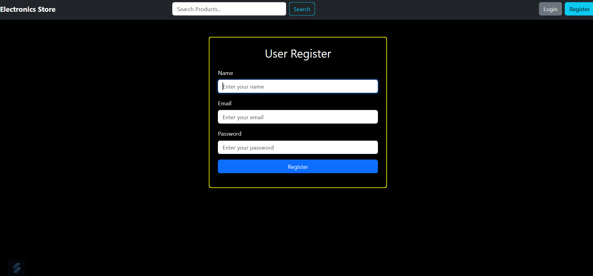
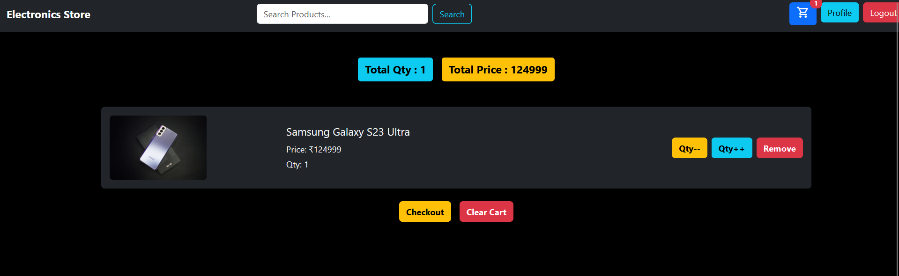
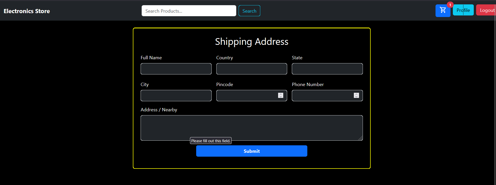
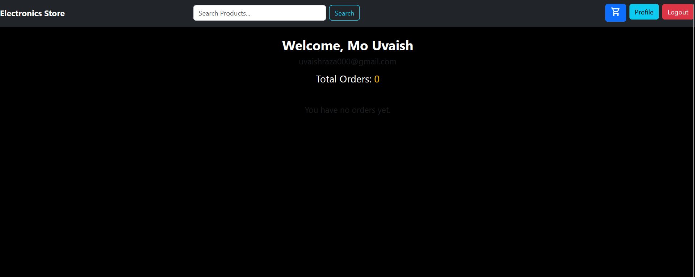

# 🛒 Electronics Store (MERN Stack E-Commerce Application)

This is a full-stack e-commerce application built using the **MERN Stack** (MongoDB, Express.js, React, Node.js). It features a complete user flow, including product browsing, authentication, cart management, and order placement.

## ✨ Key Features

* **User Authentication:** Secure Login and Registration.
* **Product Catalog:** Dynamic display of products with search and category filtering.
* **Cart Management:** Functionality to add, remove, and update product quantities in the cart.
* **Order Flow:** Step-by-step process for providing shipping details and checkout.
* **User Profile:** Dedicated page for users to view their details and order history.

## 🚀 Project Structure

The project follows a modular structure with separate repositories for the client and the server:

* `Backend/`: Contains the Node.js/Express.js server, MongoDB models, routes, and API logic.
* `Frontend/`: Contains the React application, components, state management, and user interface.

## 📸 Screenshots

A visual overview of the application's key pages:

### 1. Home Page / Product Listing
The main browsing screen where users can view products and filter them by category and price.


### 2. User Registration
The interface for new users to create an account.


### 3. Cart Page
Allows users to review selected items, adjust quantities, calculate the total price, and proceed to checkout.


### 4. Shipping Address
The form for users to enter and confirm their delivery details before completing the purchase.


### 5. User Profile
A personalized page where users can view their account information and track their orders.


## 🛠️ Installation and Setup

### Prerequisites
* Node.js (v14 or higher)
* MongoDB Instance (Local or Atlas)

### Local Setup Steps

1.  **Clone the Repository:**
    ```bash
    git clone [https://github.com/uvaish7651/Accessoseries-Store.git](https://github.com/uvaish7651/Accessoseries-Store.git)
    cd Accessoseries-Store
    ```

2.  **Backend Setup:**
    ```bash
    cd Backend
    npm install
    # Create a .env file and add your MongoDB connection string:
    npm start
    ```

3.  **Frontend Setup:**
    ```bash
    cd ../Frontend
    npm install
    npm start
    ```
    The application should now be running locally, typically on `http://localhost:3000`.

---